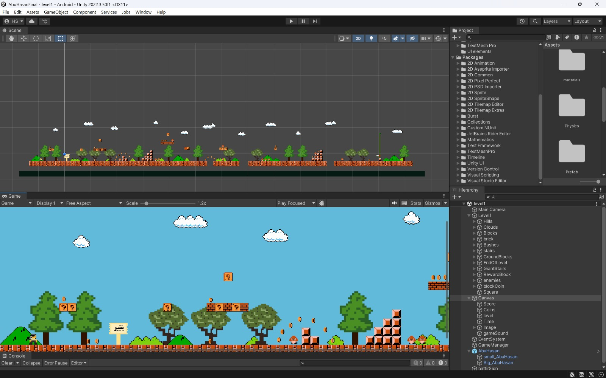

# 🌾 Abu Hassan – A Pixel-Art Palestinian Platformer Game

### 🎮 About the Game
**Abu Hassan** is a pixel-art 2D platformer game developed in Unity as part of the **Intro to Game Development** course in the **first semester of the  senior year**. The game tells the fictional story of **Abu Hassan**, a modern Palestinian farmer, who journeys through multiple levels representing real Palestinian cities while facing symbolic challenges — most notably in the form of occupation soldiers.

The game consists of **three levels**, each representing a different **Palestinian city**, and includes **screens between levels** that highlight **fun facts** about each city.

---

### 🕹️ Game Style & Visual Design

- 🎨 **Pixel-Art Inspired by Classic Super Mario Bros (1985)**  
  The game's art style is heavily inspired by the original *Super Mario Bros*, capturing a nostalgic 8-bit aesthetic.  
- 🧱 **Hand-Drawn Assets**  
  All visual assets — including the character, enemies, terrain, objects, level design elements, menus, and inter-level info screens — were **custom drawn** by hand using pixel art tools.  
  > *"The art was entirely created by me — from the floor tiles and platforms to enemy sprites and environmental objects."*  
- 🏙️ **City-Based Levels**  
  Each level corresponds to a different city in Palestine and is followed by an educational screen with fun and insightful facts about that city.

---

### 👩‍💻 Development Team
- 💡 Original Idea: [Tala Okeh]
- 👩‍💻 **Hind Sumary** – Pixel artist, visual designer.  
- 👩‍💻 **Partner - @rama-shaheen** – Logic implementation as a C# developer and Unity integration support  
This was a **team of two**, collaboratively developing the full game over two months.

---

### 📅 Development Timeline
- **Start Date:** December 2023  
- **Completion Date:** January 2024  
- Duration: ~8 weeks (from prototyping to final polishing)

---

### 🛠️ Technologies Used
- **Unity Game Engine**
- **C#** (C Sharp) for scripting logic and behavior
- **Aseprite / Piskel** for pixel art
- Unity’s **Tilemap system**, **2D physics**, **collision layers**, and **animation controllers**

---

### 📽️ Gameplay Demo

[▶️ Click to Watch Demo](https://streamable.com/rqxui0)

---

### 🖼️ Screenshots from Development

| City-Level 1 Design | City-Level 2 Design | City-Level 3 Design |
|-------------------|--------------------|----------------------------|
|  |  |  |

---

### 🌟 Personal Reflection

This game was a **unique and challenging experience** that helped me grow significantly in both **C# programming** and **game asset design**. Creating pixel art from scratch, especially for culturally inspired environments, taught me attention to detail and consistency. Implementing that art into working gameplay in Unity was a transformative step in my learning journey.

---

### 🚩 Themes & Context

- 🧑‍🌾 **Fictional Narrative:** The game uses metaphor and symbolism to reflect resistance and cultural identity through a fun and educational lens.
- 🇵🇸 **Palestinian Cities Focus:** The game brings visibility to Palestinian cities and their history through interactive storytelling.
- 🎓 **Educational Purpose:** Designed within an academic setting to explore mechanics, art direction, and player engagement through storytelling.

> *Note: All characters and scenarios are symbolic and were created as part of an educational project. This game is not affiliated with any political entity.*

---

### 📫 Contact
Feel free to reach out with any questions via GitHub, LinkedIn or Gmail.

---
